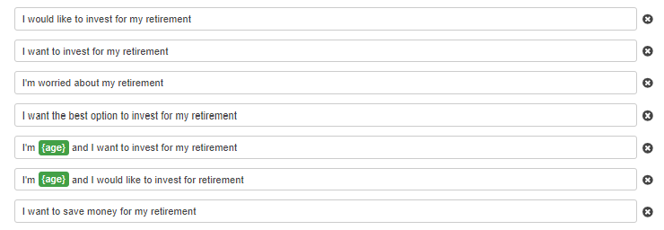

# AWS_Robo_Adviser
Lex bot created using AWS Lex and Lambda functions to deliver an automated chat service detailing risk on an investment.

---

## Technologies

Language: Python 

[Amazon Lex](https://aws.amazon.com/lex/) - AWS service for creating automated chat bots

[Amazon Lambda](https://aws.amazon.com/lambda/) - AWS service for creating complex functions for use in other AWS services such as Lex

---

## Installation Guide

There is nothing to install as Amazon Web Services are accessed through **[aws.amazon.com](aws.amazon.com)**

---

## Usage

I have not published this bot so there is no public usage at this point. There are GIFs below showing how it works.

Ultimately the user inputs their first name, age, amount for investment and their risk level.

The bot stores this information and recommends a split of bonds (AGG) and/or stocks (SPY)

---

## Overview of Project

### Bot Set Up

Slots:

Utterances:

### Helper Functions

### Lambda Function

### Test Cases

Incorrect Amount: 

Negative Age: 

Too High of an Age: 

Correct Info: 

### Recommendation Display

---

## Gifs of Bot Working

### Test

### Full Build

> if the gifs are not in high enough resolution just go to:
>[test video](videos/Lex_Bot_Test.mp4) | 
>[full video](videos/Lex_Bot_Full.mp4)

---

## Contributors

Created by Silvano Ross while in the UW FinTech Bootcamp
> Contact Info:
> email: silvanoross3@gmail.com |
> [GitHub](https://github.com/silvanoross) |
> [LinkedIn](https://www.linkedin.com/in/silvano-ross-b6a15a93/)

---

## License

- [MIT](LICENSE)